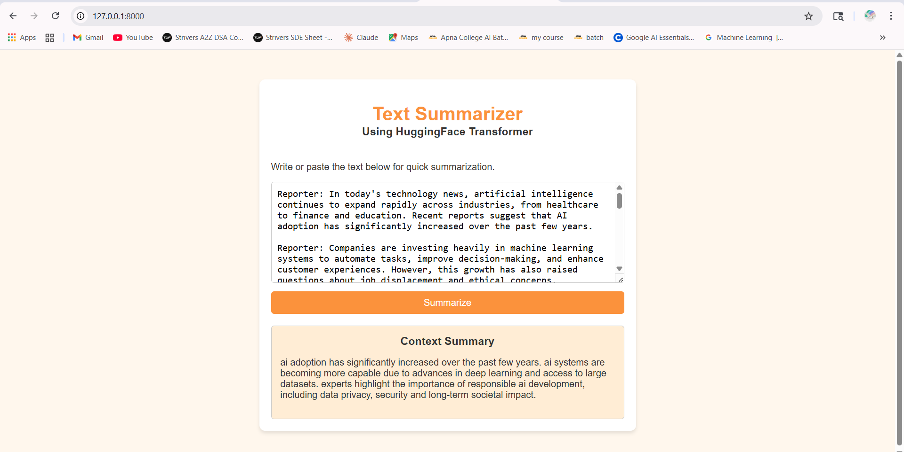

# Text Summarizer App

[](https://python.org)
[](https://fastapi.tiangolo.com)
[](https://huggingface.co)

> A web app that summarizes dialogue and text using a fine-tuned T5 model, served via FastAPI with an HTML frontend.

---

## Demo



---

## How It Works

## Stack

| Layer | Technology |
|-------|------------|
| Model | T5 (fine-tuned, via HuggingFace Transformers) |
| Backend | FastAPI + Pydantic |
| Frontend | HTML |
| Inference | PyTorch (CPU / CUDA / MPS) |

---

## Run Locally

```bash
git clone https://github.com/snehal-k04/Text_Summarizer_app.git
cd Text_Summarizer_app
pip install -r requirements.txt
uvicorn app:app --reload
```

Then open `http://127.0.0.1:8000` in your browser.

---

## API

`POST /summarize/` — accepts `{ "dialogue": "your text here" }`, returns `{ "summary": "..." }`
